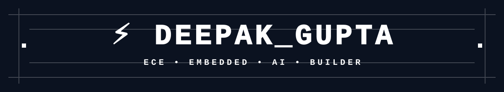

<div align="center">

<div align="center">



</div>

### ECE Student • Embedded Systems • AI • Builder


<br>

[](https://github.com/imdeepx11)
[](https://linkedin.com/in/imdeepx11)
[](https://instagram.com/deepxk.11_)

</div>

---

# 👤 ABOUT ME

> **ECE Student × Builder × Vibe Coder**

Hey! I'm **Deepak Gupta**, an Electronics & Communication Engineering student who enjoys building at the intersection of **electronics, software and AI**.

- 🎓 B.Tech ECE — JSS Academy of Technical Education, Noida
- 🔌 Exploring Embedded Systems, Arduino & IoT
- 🤖 Interested in AI/ML and AI-assisted development
- 💻 Learning Java, Python and programming fundamentals
- ⚡ Turning ideas into working projects
- 🧠 Exploring VLSI and semiconductor technologies

---

# ⚒️ TECH STACK

### 💻 Programming


### 🔌 Electronics & Embedded


`Embedded Systems` `Sensors` `PWM` `Logic Gates` `Circuit Simulation`

### 🧰 Tools


---

# 🚀 FEATURED PROJECTS

<table>
<tr>
<td width="50%">

### 🛰️ SENTINEL-X
**Radar-Assisted Bluetooth-Controlled Autonomous Vehicle**

- Arduino-based rover
- Bluetooth wireless control
- Radar-assisted detection
- Servo scanning mechanism
- Embedded hardware + software

`Arduino` `Sensors` `Embedded C`

[→ View Repository](https://github.com/imdeepx11/SENTINEL-X)

</td>
<td width="50%">

### 🤖 NEXORA-AI
**AI-powered platform**

- Python backend
- AI-assisted functionality
- Modern web interface
- API integration
- Full-stack experimentation

`Python` `AI/ML` `Web`

[→ View Repository](https://github.com/imdeepx11/NEXORA-AI)

</td>
</tr>
</table>

---

# 📊 GITHUB STATS

<div align="center">


<br>


</div>

---

# 🌱 CURRENTLY LEARNING

```
[████████████████░░░░]  Embedded Systems
[████████████░░░░░░░░]  VLSI & Semiconductor Technology
[██████████████░░░░░░]  AI / Machine Learning
[█████████████░░░░░░░]  IoT & Communication
[██████████░░░░░░░░░░]  Data Structures & Algorithms
```

---

# 🧩 CONTRIBUTION ACTIVITY

<div align="center">


</div>

---

# 🎮 BEYOND CODE

`🏏 Cricket` `✈️ Travel` `📸 Photography` `🎬 Editing` `💡 Electronics` `🤖 AI`

---

<div align="center">

### `BUILD. EXPERIMENT. LEARN. REPEAT.`

**Thanks for visiting my profile!** ⚡


</div>
